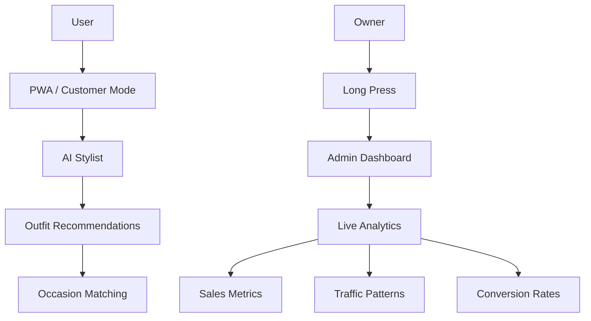

```
    ▄▄▄▄▄    ▄  █ ██   █    ████▄ ▄█▄    █▄▄▄▄ ▄█▄    
  ▐▀ ▄█ ▀▄  █   █ █ █  █    █   █ █▀ ▀▄  █  ▄▀ █▀ ▀▄  
   ▐▀███ ▀ ▄ █ ▄   █▄▄█ █    █   █ █   ▀  █▀▀▌  █   ▀  
  ▐█▄ ▐█  ▐  █▄█  █  █ ███▄ ▀████ █▄  ▄▀ █  █  █▄  ▄▀ 
   ▀███ █     ▀ ▀     █     ▀     ▀███▀   █    ▀███▀  
                    █                         █        
                   ▀                        ▀        
```

# StyleOS Pro: الذكاء الاصطناعي للأزياء | AI Fashion Intelligence

<div align="center">

[](https://reactjs.org/)
[](https://vitejs.dev/)
[](https://tailwindcss.com/)
[](https://www.framer.com/motion/)
[](https://web.dev/progressive-web-apps/)
[](https://recharts.org/)

</div>

<div align="center">

[](https://github.com/amrikyy/styleos-pro)
[](https://github.com/amrikyy/styleos-pro/blob/main/LICENSE)
[](https://github.com/amrikyy/styleos-pro)

</div>

## 🚀 مرحباً بك في المستقبل | Welcome to the Future

StyleOS Pro هو نظام مزدوج الواجهة متطور يجمع بين تجربة مستخدم سيبربUNK مع لوحة تحكم إدارية قوية. يتيح للعملاء استكشاف توصيات الأزياء المدعومة بالذكاء الاصطناعي في بيئة تفاعلية، بينما يوفر للمسؤولين بيانات تحليلية حيوية في الوقت الفعلي.

StyleOS Pro is an advanced dual-interface system that combines a cyberpunk user experience with a powerful admin dashboard. It allows customers to explore AI-powered fashion recommendations in an interactive environment, while providing administrators with vital real-time analytics.

## 🎯 الرؤية | The Vision

نظام هجين للإرشاد بالأزياء والذكاء التجاري: واجهة العميل (تجربة سيبربUNK للذكاء الاصطناعي) وواجهة المشرف (لوحة تحليلات الأعمال).

Hybrid AI Stylist & Business Intelligence System: Customer Interface (AI-powered cyberpunk experience) and Admin Interface (Business analytics dashboard).

## 🏗️ مخطط النظام | System Architecture



## ✨ المميزات | Features

- **تكامل التجارة عبر واتساب**: روابط مباشرة للتسوق
- **ردود فعل حسية**: تغذية راجعة متعددة الحواس
- **وضع عدم الاتصال**: دعم تطبيق ويب تقدمي
- **واجهة سيبربUNK**: تصميم تفاعلي مع تأثيرات نيون
- **لوحة تحكم إدارية مخفية**: تحليلات في الوقت الفعلي

- **WhatsApp Checkout**: Direct shopping links
- **Haptic Feedback**: Multi-sensory feedback
- **Offline Mode**: Progressive web app support
- **Cyberpunk UI**: Interactive design with neon effects
- **Hidden Admin Panel**: Real-time analytics

## 📱 معاينات واجهة المستخدم | UI Mockups


## 🛠️ التقنيات | Tech Stack

- **React 18** - مكتبة واجهة المستخدم | User interface library
- **Vite** - أداة بناء سريعة | Fast build tool
- **Tailwind CSS** - إطار عمل تصميم سريع | Rapid styling framework
- **Framer Motion** - رسوم متحركة متقدمة | Advanced animations
- **Recharts** - مخططات تحليلية | Analytics charts
- **React Router** - توجيه العميل | Client-side routing
- **PWA Plugin** - تطبيق ويب تقدمي | Progressive web app
- **Web Audio API** - تأثيرات صوتية | Audio effects
- **Navigator API** - ردود فعل حسية | Haptic feedback

## 📦 التثبيت | Installation

1. استنساخ المستودع | Clone the repository
   ```bash
   git clone <repository-url>
   ```

2. تثبيت الحزم | Install packages
   ```bash
   npm install
   ```

3. بدء الخادم التنموي | Start the development server
   ```bash
   npm run dev
   ```

## 🚀 التشغيل | Running

- التطور | Development: `npm run dev`
- الإنتاج | Production: `npm run build`
- المعاينة | Preview: `npm run preview`

## 🎨 تجربة المستخدم | User Experience

- **متجاوب بالكامل**: يعمل على جميع أحجام الشاشات
- **دعم PWA**: تثبيت كتطبيق على الهاتف
- **ردود فعل حسية**: تغذية راجعة باللمس
- **أداء سريع**: تحميل فوري وتفاعل سلس

- **Fully Responsive**: Works on all screen sizes
- **PWA Support**: Install as mobile app
- **Haptic Feedback**: Touch-based feedback
- **Fast Performance**: Instant loading and smooth interactions

## 📈 ميزات الأعمال | Business Features

- **تحليلات الوقت الفعلي**: بيانات فورية على لوحة الإدارة
- **تتبع المبيعات**: مراقبة أداء المنتجات
- **تحليلات الزوار**: فهم أنماط التصفح
- **توليد الرموز الترويجية**: حملات ترويج تلقائية

- **Real-time Analytics**: Instant data on admin dashboard
- **Sales Tracking**: Product performance monitoring
- **Visitor Analytics**: Browsing pattern insights
- **Promo Code Generation**: Automated promotional campaigns

## 🤖 تكامل الذكاء الاصطناعي | AI Integration

- **توصيات مخصصة**: بناءً على المناسبة والميزانية
- **تحليل الاتجاهات**: بيانات السوق في الوقت الفعلي
- **مطابقة الأزياء**: توصيات بناءً على الأسلوب الشخصي

- **Personalized Recommendations**: Based on occasion and budget
- **Trend Analysis**: Real-time market data
- **Style Matching**: Recommendations based on personal style

## 🔐 الوصول السري | Secret Access

للوصول إلى لوحة المشرف، اضغط باستمرار على الشعار في واجهة العميل لمدة 3 ثوانٍ.

To access the admin dashboard, long-press the logo on the customer interface for 3 seconds.

## 📋 الترخيص | License

تم الترخيص لهذا المشروع بموجب رخصة MIT - راجع ملف [LICENSE](LICENSE) للحصول على التفاصيل.

This project is licensed under the MIT License - see the [LICENSE](LICENSE) file for details.

## 👨‍💻 مهندس النظام | System Architect

**Mohamed Abdelaziz** - مهندس أنظمة الذكاء الاصطناعي | AI Systems Engineer

> "لا أكتب فقط التعليمات البرمجية؛ بل أفكك الواقع إلى خوارزميات. يركز عملي على بناء أنظمة الذكاء الاصطناعي عالية التردد ووكلاء مستقلين يحلون المشاكل المعقدة بدقة رياضية."

> "I don't just write code; I deconstruct reality into algorithms. My work focuses on building high-frequency AI systems and autonomous agents that solve complex problems with mathematical precision."

- 🛡️ **Current Focus**: Building AI Trust Infrastructure & Security Systems
- 🤖 **Specialty**: Autonomous Agents & Decentralized Logic Gates
- 📧 **Contact**: Connect through GitHub for collaborations
- 🌐 **Profile**: [Moeabdelaziz007](https://github.com/Moeabdelaziz007)

---

<div align="center">

Made with ❤️ for the future of AI fashion

صنع بـ ❤️ لمستقبل الأزياء المدعومة بالذكاء الاصطناعي

</div>